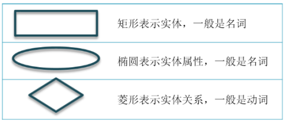

<h1 sytle="text-align:ceneter;">MySQL 基础</h1>

下面内容都是我的学习笔记。

# 第一章 初识 MySQL

## 第一节 数据库基础知识

### 1、数据库

#### 1.1 概念

数据库，英文名称为 Database，简称 DB。从字面意思来看就是存储数据的仓库；从专业角度解释为存储在计算机磁盘上的有组织、可共享的大量数据的集合。


#### 1.2 数据库的类型

数据库分为 **关系型数据库** 和 **非关系型数据库** 两大类。常见的关系型数据库有 `MySQL`、`Oracle`、`SQL Server`、`SQLite`、`DB2` 等。常见的非关系型数据库有 `Redis`、`MongoDB` 等。

#### 1.3 数据库管理系统

数据库管理系统，英文名称为 Database Management System，简称 DBMS。主要用于科学组织和存储数据、高效的获取和维护数据。比如 `Navicat`。

### 2、MySQL 介绍和安装

#### 2.1 MySQL 介绍

- `MySQL` 是目前最流行的开源的、免费的关系型数据库，适用于中小型甚至大型互联网应用，能够在 Windows 和 Linux 平台上部署。
- MySQL Oracle 属于Oracle公司。

#### 2.2 MySQL 安装

略

#### 2.3 连接数据库

找到 MySQL 安装目录下的 bin 目录，然后打开命令窗口，在命令窗口中按如下语法输入命令：

```
mysql -h MySQL数据库服务器的IP地址 -u 用户名 -p
```

然后按下回车键，输入密码即可。

## 第二节 结构化查询语言

### 1、SQL 分类

结构化查询语句，英文名称为 Structured Query Language，简称 `SQL`。结构化查询语句分为数据定义语言、数据操作语言、数据查询语言和数据控制语言四大类。

| 名称 | 描述 | 命令 |
| ---- | --- | --- |
| 数据定义语言 (`DDL`) | 数据库、数据表的创建、修改和删除 | `CREATE`、`ALTER`、`DROP` |
| 数据操作语言 (`DML`) | 数据的增加、修改和删除 | `INSERT`、`UPDATE`、`DELETE` |
| 数据查询语言 (`DQL`) | 数据的查询 | `SELECT` |
| 数据控制语言 (`DCL`) | 用户授权、事务的提交和回滚 | `GRANT`、`COMMIT`、`ROLLBACK` |

### 2、数据库操作

#### 2.1 创建数据库的语法

```sql
CREATE DATABASE [IF NOT EXISTS] 数据库名称 DEFAULT CHARACTER SET 字符集 COLLATE 排序规则;
```

示例：创建数据库 `lesson`，并指定字符集为 `GBK`，排序规则为 `GBK_CHINESE_CI`

```sql
CREATE DATABASE IF NOT EXISTS lesson DEFAULT CHARACTER SET GBK COLLATE GBK_CHINESE_CI;
```

#### 2.2 修改数据库的语法

```sql
ALTER DATABASE 数据库名称 CHARACTER SET 字符集 COLLATE 排序规则;
```

示例：修改数据库 `lesson` 的字符集为 `UTF8`，排序规则为 `UTF8_GENERAL_CI`

```sql
ALTER DATABASE lesson CHARACTER SET UTF8 COLLATE UTF8_GENERAL_CI;
```

#### 2.3 删除数据库的语法

```sql
DROP DATABASE [IF EXISTS] 数据库名称;
```

示例：删除数据库 `lesson`

```sql
DROP DATABASE IF EXISTS lesson;
```

#### 2.4 查看数据库语法

```sql
SHOW DATABASES;
```

#### 2.5 使用数据库的语法

```sql
USE 数据库名称;
```

示例：使用数据库 `lesson`

```sql
USE lesson;
```

### 3、列类型

#### 3.1 数值类型

| 类型 | 说明 | 取值范围 | 存储需求 |
| --- | --- | --- | --- |
| `tinyint` | 非常小的数据 | 有符号值: $-2^7$ ~ $2^7-1$ 无符号值: $0$ ~ $2^8-1$ | $1$ 字节 |
| `smallint` | 较小的数据 | 有符号值: $-2^{15}$ ~ $2^{15}-1$ 无符号值: $0$ ~ $2^{16}-1$ | $2$ 字节 |
| `mediumint` | 中等大小的数据 | 有符号值: $-2^{23}$ ~ $2^{23}-1$ 无符号值: $0$ ~ $2^24-1$ | $3$ 字节 |
| `int` | 标准整数 | 有符号值: $-2^{31}$ ~ $2^{31}-1$ 无符号值: $0$ ~ $2^{32}-1$ | $4$ 字节 |
| `bigint` | 较大的整数 | 有符号值: $-2^{63} ~ 2^{63}-1$ 无符号值: $0$ ~ $2^{64}-1$ | $8$ 字节 |
| `float` | 单精度浮点数 | 无符号值: $1.1754351 \times 10^{-38}$ ~ $3.402823466 \times 1038$ | $4$ 字节 |
| `double` | 双精度浮点数 | 无符号值: $2.22507385 \times 10^{-308}$ ~ $1.79769313\times 10^{308}$ | $8$ 字节 |
| `decimal` | 字符串形式的浮点数 | `decimal(m, d)` | $m$ 个字节 |

#### 3.2 日期时间类型

| 类型 | 说明 | 取值范围 |
| --- | --- | --- |
| `DATE` | `YYYY-MM-DD`，日期格式 | `1000-01-01` ~ `9999-12-31` |
| `TIME` | `HH:mm:ss`，时间格 | `-838:59:59.000000` ~ `838:59:59.000000` |
| `DATETIME` | `YY-MM-dd HH:mm:ss` | `1000-01-01 00:00:00.000000` ~ `9999-12-31 23:59:59.999999` |
| `TIMESTAMP` | `YYYY-MM-dd HH:mm:ss` 格式表示的时间戳 | `1970-01-01 00:00:01.000000` ~ `2038-01-19 03:14:07.999999` |
| `YEAR` | `YYYY` 格式的年份值 | `1901` ~ `2155` |

#### 3.3 字符串类型

| 类型 | 说明 | 最大长度 |
| --- | --- | --- |
| `char [(M)]` | 固定长字符串，检索快但费空间，$0 <= M <= 255$ | $M$ 字符 |
| `varchar [(M)]` | 可变字符串 $0 <= M <= 65535$ | 变长度 |
| `text` | 文本串 | $2^{16}–1$ 字节 |

#### 3.4 列类型修饰属性

| 属性名 | 说明 | 示例 |
| --- | --- | --- |
| `UNSIGNED` | 无符号，只能修来修饰数值类型，表名该列数据不能出现负数 | `INT(4) UNSIGNED`，表示只能为 $4$ 位大于等于 $0$ 的整数 |
| `ZEROFILL` | 不足的位数使用 $0$ 来填充 | `INT(4) ZEROFILL`，如果给定的值为 $10$，此时只有 $2$ 位，而该列需要 $4$ 位，不足的 $2$ 位由 $0$ 来填充，最终值为 $0010$ |
| `NOT NULL` | 表示该列类型的值不能为空 | `VARCHAR (20) NOT NULL`，表示该列数据不能为空值 |
| `DEFAULT` | 表示设置默认值 | `INT(4) DEFAULT 0`，表示该列不赋值时默认为 $0$ |
| `AUTO_INCREMENT` | 表示自增长，只能应用于数值列类型，该列类型必须为键，且不能为空 | `INT(11) AUTO_INCREMENT NOT NULL PRIMARY KEY`。第一次为该列中插入值时为 $1$，第二次为 $2$ |

### 4、数据表操作

#### 4.1 数据表类型

`MySQL` 中的数据表类型有很多种，如 `MyISAM`、`InnoDB`、`HEAP`、`BOB`、`CSV` 等。其中最常用的就是 `MyISAM` 和 `InnoDB`。

#### 4.2 MyISAM 与 InnoDB 的区别

| 名称 | `MyISAM` | `InnoDB` |
| :---: | :---: | :---: |
| 事务处理 | 不支持 | 支持 |
| 数据行锁定 | 不支持 | 支持 |
| 外键约束 | 不支持 | 支持 |
| 全文索引 | 支持 | 不支持 |
| 表空间大小 | 较小 | 较大，约2倍 |

- 事务：涉及的所有操作是一个整体，要么都执行，要么都不执行（原子性）。
- 数据行锁定：一行数据，当一个用户在修改该数据时，可以直接将该条数据锁定。
- 如何选择数据表的类型：当涉及的业务操作以查询居多，修改和删除较少时，可以使用 `MyISAM`。当涉及的业务操作经常会有修改和删除 操作时，使用 `InnoDB`。

#### 4.3 创建数据表

```sql
CREATE TABLE [IF NOT EXISTS] 数据表名称(
    字段名1 列类型(长度) [修饰属性] [键/索引] [注释],
    字段名2 列类型(长度) [修饰属性] [键/索引] [注释],
    字段名3 列类型(长度) [修饰属性] [键/索引] [注释],
    ......
    字段名n 列类型(长度) [修饰属性] [键/索引] [注释]
) [ENGINE = 数据表类型][CHARSET=字符集编码] [COMMENT=注释];
```

示例：创建学生表，表中有字段学号、姓名、性别、年龄和成绩。

```sql
CREATE TABLE IF NOT EXISTS student(
    `number` VARCHAR(30) NOT NULL PRIMARY KEY COMMENT '学号，主键',
    `name` VARCHAR(30) NOT NULL COMMENT '姓名',
    `sex` TINYINT(1) UNSIGNED DEFAULT 0 COMMENT '性别：0-男 1-女 2-其他',
    `age` TINYINT(3) UNSIGNED DEFAULT 0 COMMENT '年龄',
    `score` DOUBLE(5, 2) UNSIGNED COMMENT '成绩'
)ENGINE=InnoDB CHARSET=UTF8 COMMENT='学生表';
```

#### 4.4 修改数据表

- **修改表名**
	```sql
	ALTER TABLE 表名 RENAME AS 新表名;
	```
	示例：将 `student` 表名称修改为 `stu`。
	```sql
	ALTER TABLE student RENAME AS stu;
	```
- **增加字段**
	```sql
	ALTER TABLE 表名 ADD 字段名 列类型(长度) [修饰属性] [键/索引] [注释];
	```
	示例：在 `stu` 表中添加字段联系电话 (`phone`)，类型为字符串，长度为 $11$，非空。
	```sql
	ALTER TABLE stu ADD phone VARCHAR(11) NOT NULL COMMENT '联系电话';
	```
- 查看表结构
	```sql
	DESC 表名; -- 查看结构
	```
- **修改字段**
	```sql
	-- MODIFY 只能修改字段的修饰属性
	ALTER TABLE 表名 MODIFY 字段名 列类型(长度) [修饰属性] [键/索引] [注释];

	-- CHANGE 可以修改字段的名字以及修饰属性
	ALTER TABLE 表名 CHANGE 字段名 新字段名 列类型(长度) [修饰属性] [键/索引] [注释];
	```
	示例： 将 `stu` 表中的 `sex` 字段的类型设置为 `VARCHAR`，长度为 $2$，默认值为 `男`，注释为 `性别，男，女，其他`。
	```sql
	ALTER TABLE stu MODIFY sex VARCHAR(2) DEFAULT '男' COMMENT '性别：男，女，其他';
	```
	示例：将 `stu` 表中 `phone` 字段修改为 `mobile`，属性保持不变。
	```sql
	ALTER TABLE stu CHANGE phone mobile VARCHAR(11) NOT NULL COMMENT '联系电话';
	```
- **删除字段**
	```sql
	ALTER TABLE 表名 DROP 字段名;
	```
	示例：将 `stu` 表中的 `mobile` 字段删除。
	```sql
	ALTER TABLE stu DROP mobile;
	```

#### 4.5 删除数据表

```sql
DROP TABLE [IF EXISTS] 表名;
```

示例：删除数据表 `stu`。

```sql
DROP TABLE IF EXISTS stu;
```

# 第二章 MySQL 数据的增删改查

## 课前回顾

**1. 在数据库 exercise 中创建课程表 stu_course，包含字段课程编号 (number)，类型为整数，长度为 11，是主键，自增长，非空；课程名称 (name)，类型为字符串，长度为20，非空；学分 (score)，类型为浮点数，小数点后面保留2位有效数字，长度为5，非空。**

```sql
-- 如果数据库不存在就创建数据库
CREATE DATABASE IF NOT EXISTS exercise DEFAULT CHARACTER SET UTF8 COLLATE UTF8_GENERAL_CI;

-- 使用数据库
USE exercise;

-- 在数据库钟创建数据表 stu_course
CREATE TABLE IF NOT EXISTS stu_course (
	`number` INT(11) AUTO_INCREMENT PRIMARY KEY NOT NULL COMMENT '课程编号',
	`name` VARCHAR(20) NOT NULL COMMENT '课程名称',
	`score` DOUBLE(5, 2) NOT NULL COMMENT '学分'
) ENGINE=InnoDB CHARSET=UTF8 COMMENT '课程表';
```

**2. 将课程表重命名为 course。**

```sql
ALTER TABLE stu_course RENAME AS course;
```

**3. 在课程表中添加字段学时 (time)，类型为整数，长度为 3，非空。**

```sql
ALTER TABLE course
ADD `time` INT(3) NOT NULL COMMENT '学时'; 
```

**4. 修改课程表学分类型为浮点数，小数点后面保留 1 位有效数字，长度为 3，非空。**

```sql
ALTER TABLE course
MODIFY `score` DOUBLE (3, 1) NOT NULL COMMENT '学分';
```

**5. 删除课程表**

```sql
DROP DATABASE IF EXISTS course;
```

**6. 删除数据库 exercise**

```sql
DROP DATABASE IF EXISTS exercise;
```

## 第一节 DML 语句

### 1、什么是 DML
DML (Data Manipulation Language)：数据操作语言。主要体现于对表数据的增删改操作。因此 DML 仅包括 `INSERT`、`UPDATE` 和 `DELEETE` 语句。

### 2、INSERT 语句

```sql
-- 需要注意，VALUES 后的字段值必须与表名后的字段名一一对应
INSERT INTO 表名(字段名1, 字段名2, ..., 字段名n) VALUES(字段值1, 字段值2, ..., 字段值 n);

-- 需要注意，VALUES 后的字段值必须与创建表时的字段顺序保持一一对应
INSERT INTO 表名 VALUES(字段值1, 字段值2, ..., 字段值n);

-- 一次性插入多条数据
INSERT INTO 表名(字段名1, 字段名2, ..., 字段名n) VALUES(字段值1, 字段值2, ..., 字段值 n),(字段值1, 字段值2, ..., 字段值n), ... , (字段值1, 字段值2, ..., 字段值n); INSERT INTO 表名 VALUES(字段值1, 字段值2, ..., 字段值n), (字段值1, 字段值2, ..., 字段值 n), ..., (字段值1, 字段值2, ..., 字段值n);
```

**示例**：向课程表中插入数据。

```sql
INSERT INTO course(`number`, name, score, `time`) VALUES (1, 'Java基础', 4, 40);
INSERT INTO course VALUES (2, '数据库', 3, 20);
INSERT INTO course(`number`, score, name, `time`) VALUES (3, 5, 'Jsp', 40);
INSERT INTO course(`number`, name, score, `time`) VALUES (4, 'Spring', 4, 5), (5, 'Spring Mvc', 2, 5);
INSERT INTO course VALUES (6, 'SSM', 2, 3), (7, 'Spring Boot', 2, 2);
```

### 3、UPDATE 语句

```sql
UPDATE 表名 SET 字段名1=字段值1,[字段名2=字段值2, ..., 字段名n=字段值n] [WHERE 修改条件]
```

#### 3.1 WHERE条件子句

- 在 Java 中，条件的表示通常都是使用关系运算符来表示，在 SQL 语句中也是一样，使用 `>`, `<`, `>=`, `<=`, `!=` 来表示。不同的是，除此之外，SQL 中还可以使用 SQL 专用的关键字来表示条件。这些将在后面的 DQL 语句中详细讲解。
- 在 Java 中，条件之间的衔接通常都是使用逻辑运算符来表示，在 SQL 语句中也是一样，但通常使用 AND 来表示逻辑与 (`&&`)，使用 OR 来表示逻辑或 (`||`)。

**示例**

```sql
WHERE time > 20 && time < 40; <=> WHERE time > 20 and time < 40;
```

#### 3.2 UPDATE 语句

**示例**：将数据库的学分更改为 $4$，学时更改为 $15$。

```sql
UPDATE course SET score=4, `time`=15 WHERE name='数据库';
```

### 4、DELETE语句

```sql
DELETE FROM 表名 [WHERE 删除条件];
```

**示例**：删除课程表中课程编号为 1 的数据。

```sql
DELETE FROM course WHERE `number`=1;
```

### 5、TRUNCATE语句

```sql
-- 清空表中数据
TRUNCATE [TABLE] 表名;
```

**示例**：清空课程表数据。

```sql
TRUNCATE course;
```

### 6、DELETE 与 TRUNCATE 区别

- DELETE 语句根据条件删除表中数据，而 TRUNCATE 语句则是将表中数据全部清空；如果 DELETE 语句要删除表中所有数据，那么在效率上要低于 TRUNCATE 语句。
- 如果表中有自增长列，TRUNCATE 语句会重置自增长的计数器，但 DELETE 语句不会。
- TRUNCATE 语句执行后，数据无法恢复，而 DELETE 语句执行后，可以使用事务回滚进行恢复。

## 第二节 DQL 语句

### 1、什么是 DQL

DQL (Data Query Language)：数据查询语言。体现在数据的查询操作上，因此，DQL 仅包括 SELECT 语句。

### 2、SELECT语句

```sql
SELECT ALL/DISTINCT * | 字段名1 AS 别名1[,字段名2 AS 别名2, ..., 字段名n AS 别名n] FROM 表名 WHERE 查询条件
```

**解释说明**：ALL 表示查询所有满足条件的记录，可以省略；DISTINCT 表示去掉查询结果中重复的记录；AS 可以给数据列、数据表取一个别名。

**示例**：从课程表中查询课程编号小于5的课程名称。

```sql
SELECT `name` FROM course WHERE `number` < 5;
```

**示例**：从课程表中查询课程名称为"Java基础"的学分和学时。

### 3、比较操作符

| 操作符 | 语法 | 说明 |
| :---: | --- | --- |
| IS NULL | 字段名 IS NULL | 如果字段的值为 NULL，则条件满足。 |
| IS NOT NULL | 字段名 IS NOT NULL | 如果字段的值不为 NULL，则条件满足。|
| BETWEEN...AND | 字段名 BETWEEN 最小值 AND 最大值 | 如果字段的值在最小值与最大值之间（能够取到最小值和最大值），则条件满足。 |
| LIKE | 字段名 LIKE '%匹配内容%' | 如果字段值包含有匹配内容，则条件满足。|
| IN | 字段名 IN(值1，值2，...， 值n) |如果字段值在值1,值2, ...，值n中，则条件满足。 |

**示例**：从课程表查询课程名为 NULL 的课程信息。

```sql
SELECT * FROM course WHERE name IS NULL;
```

**示例**：从课程表查询课程名不为 NULL 的课程信息。

```sql
SELECT * FROM course WHERE name IS NOT NULL;
```

**示例**：从课程表查询学分在 2 ~ 4 之间的课程信息。

```sql
SELECT * FROM course WHERE score BETWEEN 2 AND 4;
```

**示例**：从课程表查询课程名包含"V"的课程信息。

```sql
SELECT * FROM course WHERE name LIKE '%v%';
```

**示例**：从课程表查询课程名以"J"开头的课程信息。

```sql
SELECT * FROM course WHERE name LIKE 'J%'; 
```

**示例**：从课程表查询课程名以"p"结尾的课程信息。

```sql
SELECT * FROM course WHERE name LIKE '%p'; 
```

**示例**：从课程表查询课程编号为 1，3，5 的课程信息。

```sql
SELECT * FROM course WHERE `number` IN (1, 3, 5);
```

### 4、分组

数据表准备：新建学生表 `student`，包含字段学号 (`no`)，类型为长整数，长度为 20，是主键，自增长，非空；姓名 (`name`)，类型为字符串，长度为 20，非空；性别 (`sex`)，类型为字符串，长度为 2，默认值为"男"；年龄 (`age`)，类型为整数，长度为 3，默认值为 0；成绩 (`score`)，类型为浮点数，长度为 5，小数点后面保留 2 位有效数字。

```sql
DROP TABLE IF EXISTS student;
CREATE TABLE student (
	`no` BIGINT(20) AUTO_INCREMENT NOT NULL PRIMARY KEY COMMENT '学号，主键',
	`name` VARCHAR(20) NOT NULL COMMENT '姓名',
	`sex` VARCHAR(2) DEFAULT '男' COMMENT '性别',
	age INT(3) DEFAULT 0 COMMENT '成绩'
) ENGINE=InnoDB CHARSET=UTF8 COMMENT '学生表';
```

插入测试数据：

```sql
INSERT INTO student(no, name, sex, age, score) VALUES (DEFAULT, '张三', '男', 20, 59);
INSERT INTO student(no, name, sex, age, score) VALUES (DEFAULT, '李四', '女', 19, 62);
INSERT INTO student(no, name, sex, age, score) VALUES (DEFAULT, '王五', '其他', 21, 62);
INSERT INTO student(no, name, sex, age, score) VALUES (DEFAULT, '龙华', '男', 22, 75);
INSERT INTO student(no, name, sex, age, score) VALUES (DEFAULT, '金凤', '女', 18, 80);
INSERT INTO student(no, name, sex, age, score) VALUES (DEFAULT, '张华', '其他', 27, 88); 
INSERT INTO student(no, name, sex, age, score) VALUES (DEFAULT, '李刚', '男', 30, 88);
INSERT INTO student(no, name, sex, age, score) VALUES (DEFAULT, '潘玉明', '女', 28, 81);
INSERT INTO student(no, name, sex, age, score) VALUES (DEFAULT, '凤飞飞', '其他', 32, 90);
```

#### 4.1 分组查询

```sql
SELECT ALL/DISTINCT * | 字段名1 AS 别名1[,字段名1 AS 别名1, ..., 字段名n AS 别名n] FROM 表名 WHERE 查询条件 GROUP BY 字段名1，字段名2,..., 字段名n
```

分组查询所得的结果只是该组中的第一条数据。

**示例**：从学生表查询成绩在 $80$ 分以上的学生信息并按性别分组。

```sql
SELECT * FROM student WHERE score > 80 GROUP BY sex;
```

**示例**：从学生表查询成绩在 $60$ ~ $80$ 之间的学生信息并按性别和年龄分组。

```sql
SELECT * FROM student WHERE score BETWEEN 60 AND 80 GROUP BY sex, age;
```

#### 4.2 聚合函数

- `COUNT()`：统计满足条件的数据总条数
	**示例**：从学生表查询成绩在 $80$ 分以上的学生人数。
	```sql
	SELECT COUNT(*) total FROM student WHERE score > 80;
	```
- `SUM()`：只能用于数值类型的字段或者表达式，计算该满足条件的字段值的总和。
	**示例**：从学生表查询不及格的学生人数和总成绩。
	```sql
	SELECT COUNT(*) totalCount, SUM(score) totalScore FROM student WHERE score < 60;
	```
- `AVG()`：只能用于数值类型的字段或者表达式，计算该满足条件的字段值的平均值。
	**示例**：从学生表查询男生、女生、其他类型的学生的平均成绩。
	```sql
	SELECT sex, AVG(score) avgScore FROM student GROUP BY sex;
	```
- `MAX()`：只能用于数值类型的字段或者表达式，计算该满足条件的字段值的最大值。
	**示例**：从学生表查询学生的最大年龄。
	```sql
	SELECT MAX(age) FROM student;
	```
- `MIN()`：只能用于数值类型的字段或者表达式，计算该满足条件的字段值的最小值。
	**示例**：从学生表查询学生的最低分。
	```sql
	SELECT MIN(score) FROM student;
	```

#### 4.3 分组查询结果筛选

```sql
SELECT ALL/DISTINCT * | 字段名1 AS 别名1[,字段名1 AS 别名1, ..., 字段名n AS 别名n] FROM 表名 WHERE 查询条件 GROUP BY 字段名1，字段名2,..., 字段名n HAVING 筛选条件
```

分组后如果还需要满足其他条件，则需要使用 `HAVING` 子句来完成。

**示例**：从学生表查询年龄在 $20$ ~ $30$ 之间的学生信息并按性别分组，找出组内平均分在 $74$ 分以上的组。

```sql
SELECT * FROM student WHERE age BETWEEN 20 AND 30 GROUP BY sex HAVING avg(score) > 74;
```

### 5、排序

```sql
SELECT ALL/DISTINCT * | 字段名1 AS 别名1[,字段名1 AS 别名1, ..., 字段名n AS 别名n] FROM 表名 WHERE 查询条件 ORDER BY 字段名1 ASC|DESC，字段名2 ASC|DESC,..., 字段名n ASC|DESC
```

`ORDER BY` 必须位于 `WHERE` 条件之后。

**示例**：从学生表查询年龄在 $18$ ~ $30$ 岁之间的学生信息并按成绩从高到低排列，如果成绩相同，则按年龄从小到大排列。

```sql
SELECT * FROM student WHERE age BETWEEN 18 AND 30 ORDER BY score DESC, age ASC;
```

### 6、分页

```sql
SELECT ALL/DISTINCT * | 字段名1 AS 别名1[,字段名1 AS 别名1, ..., 字段名n AS 别名n] FROM 表名 WHERE 查询条件 LIMIT 偏移量, 查询条数
```

- `LIMIT` 的第一个参数表示偏移量，也就是跳过的行数。
- `LIMIT` 的第二个参数表示查询返回的最大行数，可能没有给定的数量那么多行。

示例：从学生表分页查询成绩及格的学生信息，每页显示 $3$ 条，查询第 $2$ 页学生信息。

```sql
SELECT * FROM student WHERE score >= 60 LIMIT 3, 3;
```

**注意**：如果一个查询中包含分组、排序和分页，那么它们之间必须按照分组 $\to$ 排序 $\to$ 分页的先后顺序排列。

# 第三章 MySQL 常用函数

## 课前回顾

现有员工表 `emp`，包含字段员工编号 (`no`)，类型为整数，长度为 $20$，是主键，自增长，非空；姓名 (`name`)，类型为字符串，长度为 $20$，非空；性别 (`sex`)，类型为字符串，长度为 $2$，默认值为"男"；年龄 (`age`)，类型为整数，长度为 $3$，非空；所属部门 (`dept`)，类型为字符串，长度为 $20$，非空；薪资 (`salary`)，类型为浮点数，长度为 $10$，小数点后面保留 $2$ 位有效数字，非空。

```sql
CREATE TABLE IF NOT EXISTS emp(
	`no` BIGINT(20) AUTO_INCREMENT PRIMARY KEY NOT NULL COMMENT '员工编号',
	`name` VARCHAR(20) NOT NULL COMMENT '姓名', 
	`sex` VARCHAR(2) DEFAULT '男' COMMENT '性别',
	`age` TINYINT(3) UNSIGNED NOT NULL COMMENT '年龄',
	`dept` VARCHAR(20) NOT NULL COMMENT '所属部门',
	`salary` DOUBLE(10, 2) NOT NULL COMMENT '薪资'
)ENGINE=InnoDB CHARSET=UTF8 COMMENT '员工表';
```

**1. 向员工表插入如下数据：**

| 姓名 | 性别 | 年龄 | 部门 | 薪资 |
| :---: | :---: | :---: | :---: | :---: |
| 张三 | 男 | 22 | 研发部 | 13000 |
| 李刚 | 男 | 24 | 研发部 | 14000 |
| 金凤 | 女 | 23 | 财务部 | 8000 |
| 肖青 | 女 | 26 | 财务部 | 9000 |
| 张华 | 男 | 28 | 研发部 | 15000 |
| 董钰 | 女 | 24 | 研发部 | 12000 |
| 吴梅 | 女 | 24 | 测试部 | 9000 |
| 王玲 | 女 | 26 | 测试部 | 9500 |

```sql
INSERT INTO emp(`no`, name ,sex, age, dept, salary) VALUES(DEFAULT, '张三', '男', 22, '研发部', 13000);
INSERT INTO emp(name ,sex, age, dept, salary) VALUES('李刚', '男', 24, '研发部', 14000);
INSERT INTO emp VALUES(DEFAULT, '金凤', '女', 23, '财务部', 8000);
INSERT INTO emp(name ,sex, age, dept, salary) VALUES('肖青', '女', 26, '财务部', 9000), ('张华', '男', 28, '研发部', 15000), ('董钰', '女', 24, '研发部', 12000);
INSERT INTO emp VALUES(DEFAULT, '吴梅', '女', 24, '测试部', 9000), (DEFAULT, '王玲', '女', 26, '测试部', 9500);
```

**2. 吴梅因工作出色而被提升为测试主管，薪资调整为 11000**

```sql
UPDATE emp SET salary = 11000 WHERE name = '吴梅';
```

**3. 研发部金凤离职**

```sql
DELETE FROM emp WHERE name = '金凤';
```

**4. 从员工表中查询出平均年龄小于 25 的部门**

```sql
SELECT dept FROM emp GROUP BY dept HAVING AVG(age) < 25;
```

**5. 从员工表中统计研发部的最高薪资、最低薪资、平均薪资和总薪资**

```sql
SELECT MAX(salary), MIN(salary), AVG(salary), SUM(salary) FROM emp WHERE dept = '研发部';
```

**6. 从员工表中统计各个部门的员工数量**

```sql
SELECT dept, COUNT(*) FROM emp GROUP BY dept;
```

**7. 从员工表中查询薪资在 10000 以上的员工信息并按薪资从高到低排列**

```sql
SELECT * FROM emp WHERE salary > 10000 ORDER BY salary DESC;
```

**8. 从员工表中分页查询员工信息，每页显示 5 条员工信息，按薪资从高到低排列，查询第 2 页员工信息**

```sql
SELECT * FROM emp ORDER BY salary DESC LIMIT 5, 5;
```

## 第一节 常用数学函数

| 函数 | 说明 | 示例 |
| --- | --- | --- |
| `ABS(X)` | 返回 `X` 的绝对值。 | `SELECT ABS(-8);` |
| `FLOOR(X)` | 返回不大于 `X` 的最大整数。 | `SELECT FLOOR(1.3);` |
| `CEIL(X)` | 返回不小于 `X` 的最小整数。 | `SELECT CEIL(1.3);` |
| `TRUNCATE(X, D)` | 返回数值 `X` 保留到小数点后 `D` 位的值。 | `SELECT TRUNCATE(1.2328, 3);` |
| `ROUND(X)` | 返回离 `X` 最近的整数。 | `SELECT ROUND(1.8);` |
| `ROUND(X, D)` | 保留 `X` 小数点后 `D` 位的值，阶截断的时候要四舍五入。 | `SELECT ROUND(1.2323, 3);` |
| `RAND()` | 返回 $0$ ~ $1$ 的随机数。 | `SELECT RAND();` |
| `MOD(N, M)` | 返回 `N` 除以 `M` 之后的余数。 | `SELECT MOD(9, 2);` |

## 第二节 常用字符函数

以下是转换后的 Markdown 表格源代码：

| 函数 | 说明 | 示例 |
| --- | --- | --- |
| `CHAR_LENGTH(str)` | 计算字符串字符个数。 | `SELECT CHAR_LENGTH('中国');` |
| `LENGTH(str)` | 返回值为字符串 `str` 的长度，单位为字节。 | `SELECT LENGTH('中国');` |
| `CONCAT(s1, s2, ...)` | 将多个字符串拼接在一起，其中任意一个为 `NULL` 则返回值为 `NULL`。 | `SELECT CONCAT('ad','mn');` |
| `LOWER(str)` <br> `LOCASE(str)` | 将 `str` 中的字母全部转换成小写。 | `SELECT LOWER('ABC');` <br> `SELECT LCASE('ABC');` |
| `UPPER(str)` <br> `UCASE(str)` | 将字符串中的字母全部转换成大写。 | `SELECT UPPER('abcde');` <br> `SELECT UCASE('abcde');` |
| `LEFT(s, n)` <br> `RIGHT(s, n)` | 前者返回字符串 `s` 从最左边开始的 `n` 个字符；后者返回字符串 `s` 从最右边开始的 `n` 个字符。 | `SELECT LEFT('abcdefg', 5);` <br> `SELECT RIGHT('abcdefg', 5);` |
| `LTRIM(s)` <br> `RTRIM(s)` | 前者返回字符串 `s`，其左边所有空格被删除；后者返回字符串 `s`，其右边所有空格被删除。 | `SELECT LTRIM('  abcde  ');` <br> `SELECT RTRIM('  abcde  ');` |
| `TRIM(s)` | 返回字符串 `s` 删除了两边空格之后的字符串。 | `SELECT TRIM('abcde');` |
| `REPLACE(s, s1, s2)` | 返回一个字符串，用字符串 `s2` 替代字符串 `s` 中所有的字符串 `s1`。 | `SELECT REPLACE('ababac', 'ab', 'd');` |
| `SUBSTRING(s, n, len)` | 从字符串 `s` 中返回一个第 `n` 个字符开始、长度为 `len` 的字符串。 | `SELECT SUBSTRING('abcdef', 2, 3);` |
| `CHAR_LENGTH(str)` | 计算字符串字符个数。 | `SELECT CHAR_LENGTH('中国');` |
| `LENGTH(str)` | 返回值为字符串 `str` 的长度，单位为字节。 | `SELECT LENGTH('中国');` |

**练习**

1. 查询计科和软工各有多少人。
	```sql
	SELECT LEFT(class, 2), COUNT(*) FROM stu GROUP BY LEFT(class, 2);
	```
2. 查询名字有 $4$ 个字的学生信息。
	```sql
	SELECT * FROM stu WHERE CHAR_LENGTH(`name`) = 4;
	```
3. 查询成绩能够被 $10$ 整除的考试信息。
	```sql
	SELECT * FROM score WHERE MOD(score, 10) = 0;
	```

## 第三节 日期和时间函数

| 函数 | 说明 | 示例 |
| --- | --- | --- |
| `CURDATE()` <br> `CURRENT_DATE()` | 返回当前日期 | `SELECT CURDATE();` |
| `CURTIME()` <br> `CURRENT_TIME()` | 返回当前时间 | `SELECT CURTIME();` |
| `NOW()` <br> `CURRENT_TIMESTAMP()` <br> `SYSDATE()` | 返回当前日期和时间 | `SELECT NOW();` |
| `YEAR(d)` | 返回日期 `d` 中的年 | `SELECT YEAR(NOW());` |
| `MONTH(d)` | 返回日期 `d` 中的月份值，范围 $1$ ~ $12$ | `SELECT MONTH(NOW());` |
| `DAYOFMONTH(d)` | 返回给定日期 `d` 是当月的第几天 | `SELECT DAYOFMONTH(NOW());` |
| `HOUR(d)` | 返回给定日期 `d` 的小时数 | `SELECT HOUR(NOW());` |
| `MINUTE(d)` | 返回给定日期 `d` 的分钟数 | `SELECT MINUTE(NOW());` |
| `SECOND(d)` | 返回给定日期 `d` 的秒数 | `SELECT SECOND(NOW());` |
| `ADDDATE(d, n)` | 返回起始日期 `d` 加上 `n` 天的日期 | `SELECT ADDDATE(NOW(), 3);` |
| `TIMESTAMPDIFF(INTERVAL expr type, d1, d2)` | 返回给定日期 `d1` 和 `d2` 的时间差，按指定时间间隔类型计算（如年、月、日等 ） | `SELECT TIMESTAMPDIFF(YEAR, '2019-10-10', '2021-10-1'); ` |
| `DATE_FORMAT(d, f)` | 返回给定日期格式的字符串，按格式 `f` 格式化日期 `d` | `SELECT DATE_FORMAT(NOW(), '%Y-%m-%d %H:%i:%s');` |

## 第四节 条件判断函数

### 1、IF函数

#### 1.1 IF(条件, 表达式 1, 表达式 2)

如果条件满足，则使用表达式 1，否则使用表达式 2。

```sql
SELECT id, stu_name, course, IF(score >= 60, '及格','不及格') score FROM score;
```

#### 1.2 IFNULL(字段, 表达式)

如果字段值为空，则使用表达式，否则，使用字段值。

**示例**：将未参加考试的学生成绩展示为缺考。

```sql
SELECT id, stu_name, course, IFNULL(score, '缺考') score FROM score;
```

### 2、CASE...WHEN 语句

#### 2.1 CASE WHEN

**语法**

```sql
CASE WHEN 条件1 THEN 表达式1 [WHEN 条件2 THEN 表达式2 ...] ELSE 表达式n END
```

如果条件 $1$ 满足，则使用表达式 $1$；【如果条件 $2$ 满足，则使用表达式 $2$，... 】否则，使用表达式 $n$。相当于 C++/Java 中的多重 if..else 语句。

**示例**

```sql
SELECT (CASE WHEN (course = 'Java') THEN score ELSE 0 END) Java FROM score;
```

**行转列**：查询每位学生的各课程成绩。

```sql
SELECT
	stu_name,
	course,
	MAX(CASE WHEN (course = 'Java') THEN score ELSE 0 END) Java,
	MAX(CASE WHEN (course = 'Html') THEN score ELSE 0 END) Html,
	MAX(CASE WHEN (course = 'Jsp') THEN score ELSE 0 END) Jsp,
	MAX(CASE WHEN (course = 'Spring') THEN score ELSE 0 END) Spring
FROM score
GROUP BY stu_name;
```

#### 2.2 CASE ... WHEN 语句

**语法**

```sql
CASE 表达式 WHEN 值1 THEN 表达式1 [WHEN 值2 THEN 表达式2 ...] ELSE 表达式n END
```

如果表达式的执行结果为值 $1$，则使用表达式$1$；【执行结果为值 $2$，则使用表达式 $2$，...】否则，使用
表达式 $n$。相当于 Java 中的 switch 语句。

**示例**

```sql
SELECT (CASE course WHEN 'Java' THEN score ELSE 0 END) Java FROM score;
```

**行转列**：查询每位学生的各课程成绩。

```sql
SELECT
	stu_name,
	course,
	MAX(CASE course WHEN 'Java' THEN score ELSE 0 END) Java,
	MAX(CASE course WHEN 'Html' THEN score ELSE 0 END) Html,
	MAX(CASE course WHEN 'Jsp' THEN score ELSE 0 END) Jsp,
	MAX(CASE course WHEN 'Spring' THEN score ELSE 0 END) Spring
FROM score
GROUP BY stu_name;
```

**练习**：查询各班级性别人数，查询结果格式如图。

| 班级 | 男 | 女 | 其他 |
| :---: | :---: | :---: | :---: |
| 计科 $2$ 班 | $811$ | $822$ | $845$ |
| 软工 $1$ 班 | $825$ | $868$ | $809$ |
| 软工 $2$ 班 | $833$ | $841$ | $841$ |
| 计科 $1$ 班 | $798$ | $862$ | $845$ |

```sql
SELECT
	class,
	SUM(CASE sex WHEN 0 THEN 1 ELSE 0 END) '男',
	SUM(CASE sex WHEN 1 THEN 1 ELSE 0 END) '女',
	SUM(CASE sex WHEN 2 THEN 1 ELSE 0 END) '其他'
FROM stu
GROUP BY class;
```

## 第五节 其他函数

### 1、数字格式化函数

`FORMAT(X, D)`，将数字 `X` 格式化，将 `X` 保留到小数点后 `D` 位，截断时要进行四舍五入。

**示例**

```sql
SELECT FORMAT(1.2353, 2);
```

### 2、系统信息函数

| 函数 | 说明 | 示例 |
| --- | --- | --- |
| `VERSION()` | 获取数据库版本号 | `SELECR VERSION();` |
| `CONNECTION_ID()` | 获取服务器的连接数 | `SELECT CONNECTION_ID();` |
| `DATABASE()` <br> `SCHEMA()` | 获取当前数据库名 | `SELECT DATABASE()` <br> `SELECT SCHEMA();` |
| `USER()` <br> `SELECT_USE()` <br> `SESSION_USER()` | 获取当前用户名 | `SELECT USER()` |
| `CURRENT_USER()` <br> `CURRENT_USER` | 获取当前用户名 | `SELECT CURRENT_USER` |

# 第四章 多表查询

## 课前回顾

1. 求字符串的字符数。
	```sql
	SELECT CHAR_LENGTH('ABC');
	```

2. 将字符串"超用心"和"在线教育"拼接成新的字符串。
	```sql
	SELECT CONCAT("超用心", "在线教育");
	```


3. 求 "2019-05-04" 到现在一共有多少天。
	```sql
	SELECT TIMESTAMPDIFF(DAY, '2019-05-04', NOW());
	```


4. 如果字段 `score` 的值大于 $90$，则展示为优秀，否则展示为良好。
	```sql
	SELECT IF(score>90, '优秀', '良好');
	```

## 第一节  表与表之间的关系

### 1、表与表之间的关系

数据表是用来描述实体信息的，比如可以使用数据表来描述学生信息，也可以用数据表来描述班级信息，这样就会存在学生表和班级表。而学生和班级显然存在着一种关系：

### 2、主外键关联关系


这种关系在数据库中体现就称之为表与表之间的关系。数据库通过主外键关联关系来体现表与表之间的关联关系。


如图所示，此时学生表和班级表并没有任何关系，然而实际上学生和班级是存在归属关系。可以在学生表中添加一个字段，表名该学生所属班级，该字段值使用的是班级表中的主键，在学生表中称之为外键。这样学生表中的所属班级（外键）与班级表中的编号（主键）就产生关联关系，这种关联关系称为主外键关联关系。


### 3、主外键关联关系的定义

```sql
DROP TABLE IF EXISTS cls;
CREATE TABLE cls(
	`number` INT(11) AUTO_INCREMENT NOT NULL PRIMARY KEY COMMENT '班级编号，主键',
	`name` VARCHAR(20) NOT NULL COMMENT '班级名称',
	`grade` VARCHAR(20) NOT NULL COMMENT '年级'
)ENGINE=InnoDB CHARSET=UTF8 COMMENT='班级表'; 

DROP TABLE IF EXISTS student;
CREATE TABLE student(
	`number` BIGINT(20) AUTO_INCREMENT NOT NULL COMMENT '学号，主键',
	`name` VARCHAR(20) NOT NULL COMMENT '姓名',
	`sex` VARCHAR(2) DEFAULT '男' COMMENT '性别',
	`age` TINYINT(3) DEFAULT 0 COMMENT '年龄',
	`cls_number` INT(11) NOT NULL COMMENT '所属班级',
	PRIMARY KEY(number),
	-- 字段cls_number与cls表中的number字段相关联
	FOREIGN KEY(cls_number) REFERENCES cls(number)
)ENGINE=InnoDB CHARSET=UTF8 COMMENT='学生表';
```

### 4、约束

#### 4.1 主键约束

```sql
-- 添加主键约束：保证数据的唯一性
ALTER TABLE 表名 ADD PRIMARY KEY(字段名1,字段名2, ..., 字段名n)
-- 删除主键约束
ALTER TABLE 表名 DROP PRIMARY KEY;
```

#### 4.2 外键约束

```sql
-- 添加外键约束
ALTER TABLE 表名1 ADD CONSTRAINT 外键名称 FOREIGN KEY(表名1的字段名) REFERENCES 表名 2(表名2的字段名);
-- 删除外键约束
ALTER TABLE 表名 DROP FOREIGN KEY 外键名称;
```

#### 4.3 唯一约束

```sql
-- 为字段添加唯一约束
ALTER TABLE 表名 ADD CONSTRAINT 约束名称 UNIQUE(字段名1, 字段名2, ..., 字段名n);
-- 删除字段的唯一约束
ALTER TABLE 表名 DROP KEY 约束名称;
```

#### 4.4 非空约束

```sql
-- 为字段添加非空约束
ALTER TABLE 表名 MODIFY 字段名 列类型 NOT NULL;
-- 删除字段非空约束
ALTER TABLE 表名 MODIFY 字段名 列类型 NULL;
```

#### 4.5 默认值约束

```sql
-- 为字段添加默认值
ALTER TABLE 表名 ALTER 字段名 SET DEFAULT 默认值;
-- 删除字段的默认值
ALTER TABLE 表名 ALTER 字段名 DROP DEFAULT;
```

#### 4.6 自增约束

```sql
-- 为字段添加自增约束
ALTER TABLE 表名 MODIFY 字段名 列类型 AUTO_INCREMENT;
-- 为字段删除自增约束
ALTER TABLE 表名 MODIFY 字段名 列类型;
```

## 第二节 索引

### 1、什么是索引

在关系数据库中，索引是一种单独的、物理的对数据库表中一列或多列的值进行排序的一种存储结构，它是表中一列或多列值的集合和相应的指向表中物理标识这些值的数据页的逻辑指针清单。


索引可以对比书籍的目录来理解。

### 2、索引的作用

- 保证数据的准确性
- 提高检索速度
- 提高系统性能

### 3、索引的类型

- 唯一索引 (`UNIQUE`)：不可以出现相同的值，可以有 `NULL` 值。
- 普通索引 (`INDEX`)：允许出现相同的索引内容。
- 主键索引 (`PRIMARY KEY`)：不允许出现相同的值。
- 全文索引 (`FULLTEXT INDEX`)：可以针对值中的某个单词，但效率确实不敢恭维。
- 组合索引：实质上是将多个字段建到一个索引里，列值的组合必须唯一。

### 4、索引的创建、查看、删除

```sql
-- 创建索引
ALTER TABLE 表名 ADD INDEX 索引名称 (字段名1, 字段名2, ..., 字段名n);
-- 创建全文索引
ALTER TABLE 表名 ADD FULLTEXT 索引名称 (字段名1, 字段名2, ..., 字段名n);
-- 查看索引
SHOW INDEX FROM 表名;
-- 删除索引
ALTER TABLE 表名 DROP INDEX 索引名称;
```

### 5、使用索引的注意事项

- 虽然索引大大提高了查询速度，但也会降低更新表的速度，比如对表进行 `INSERT`，`UPDATE` 和 `DELETE` 操作，此时，数据库不仅要保存数据，还要保存一下索引文件。
- 建立索引会占用磁盘空间的索引文件。如果索引创建过多（尤其是在字段多、数据量大的表上创建索引），就会导致索引文件过大，这样反而会降低数据库性能。因此，索引要建立在经常进行查询操作的字段上。
- 不要在列上进行运算（包括函数运算），这会忽略索引的使用。
- 不建议使用 `like` 操作，如果非使用不可，注意正确的使用方式。`like '%查询内容%'` 不会使用索引，而 `like '查询内容%'` 可以使用索引。
- 避免使用 `IS NULL`、`NOT IN`、`<>`、`!=`、`OR` 操作，这些操作都会忽略索引而进行全表扫描。

## 第三节 多表查询

### 1、笛卡尔积

笛卡尔积又称为笛卡尔乘积，由笛卡尔提出，表示两个集合相乘的结果。


笛卡尔积与多表查询有什么关系呢？每一张表可以看做是一个数据的集合，多表关联串时，这些表中的数据就会形成笛卡尔积。

### 2、内连接

内连接相当于在笛卡尔积的基础上加上了连接条件。当没有连接条件时，内连接上升为笛卡尔积。

```sql
SELECT 字段名1, 字段名2, ..., 字段名n FROM 表1 [INNER] JOIN 表2 [ON 连接条件];
SELECT 字段名1, 字段名2, ..., 字段名n FROM 表1, 表2 [WHERE 关联条件 AND 查询条件];
```

**示例**

```sql
SELECT COUNT(*) FROM stu INNER JOIN score ON stu.id=score.stu_id;
SELECT COUNT(*) FROM stu, score WHERE stu.id=score.stu_id;
```

### 3、外连接

- 外连接涉及到两张表：主表和从表，要查询的信息主要来自于哪张表，哪张表就是主表。
- 外连接查询的结果为主表中所有的记录。如果从表中有和它匹配的，则显示匹配的值，这部分相当于内连接查询出来的结果；如果从表中没有和它匹配的，则显示 `null`。
- 外连接查询的结果 = 内连接的结果 + 主表中有的而内连接结果中没有的记录。
- 外连接分为 **左外连接** 和 **右外连接** 两种。左外连接使用 `LEFT JOIN` 关键字，`LEFT JOIN` 左边的是主表；右外连接使用 `RIGHT JOIN` 关键字，`RIGHT JOIN` 右边的是主表。

#### 3.1 左外连接

```sql
SELECT 字段名1, 字段名2, ..., 字段名n FROM 主表 LEFT JOIN 从表 [ON 连接条件];
```

**示例**

```sql
SELECT * FROM stu a LEFT JOIN score b ON a.id = b.stu_id WHERE score IS NULL;
```

#### 3.2 右外连接

```sql
SELECT 字段名1, 字段名2, ..., 字段名n FROM 从表 RIGHT JOIN 主表 [ON 连接条件];
```

**示例**

```sql
SELECT * FROM stu a RIGHT JOIN score b ON a.id = b.stu_id;
```

## 第四节 子查询

### 1、什么是子查询

子查询就是嵌套在其他查询中的查询。因此，子查询出现的位置只有 $3$ 种情况：在 `SELECT...FROM` 之
间、在 `FROM...WHERE` 之间、在 `WHERE`之后。

### 2、SELECT ... FROM 之间

- 执行时机是在查询结果出来之后。
- 查询 `stu` 表所有学生信息，并将性别按男、女、其他展示。

```sql
SELECT
	id,
	`name`,
	(SELECT text FROM dict WHERE type='sex' AND value=sex) sex,
	birthday,
	class
FROM stu;
```

### 3、FROM ... WHERE 之间

- 执行时机是一开始就执行。
- 查询年龄与 Java 成绩都与汤辰宇的年龄与 Java 成绩相同的学生信息

```sql
SELECT c.*, d.* FROM stu c
INNER JOIN
	score d ON c.id=d.stu_id
INNER JOIN
	(SELECT
		TIMESTAMPDIFF(YEAR, a.birthday,NOW()) age,
		b.score
	FROM stu a INNER JOIN score b ON a.id = b.stu_id
	WHERE a.name='汤辰宇'
	AND b.course='Java') e
ON TIMESTAMPDIFF(YEAR, c.birthday,NOW()) = e.age AND d.score=e.score
WHERE d.course='Java';
```

### 4、WHERE 之后

查询 Java 成绩最高的学生信息.

```sql
SELECT a.*, b.* FROM stu a INNER JOIN score b ON a.id=b.stu_id
WHERE b.score=(SELECT MAX(score) FROM score WHERE course='Java')
AND b.course='Java';
```

# 第五章 存储过程、函数、触发器和视图

## 课前回顾

1. 查询有哪些分类

- 内连接：衔接的多表必须保证数据一一对应才可能展示结果
- 左外连接：衔接的主表（`LEFT JOIN` 左边的表为主表）为准，从表中没有的数据以NULL形式展示。
- 右外连接：衔接的主表（`RIGHT JOIN` 右边的表为主表）为准，从表中没有的数据以NULL形式展示。

2. 子查询有哪些分类

- 在 `SELECT ... FROM` 之间：执行时机就是查询出结果后执行。
- 在 `FROM ... WHERE` 之间：执行时机是一开始就先执行。
- 在 `WHERE` 之后：执行时机是筛选数据时执行。

## 第一节 变量

在 MySQL 中，变量分为四种类型，即局部变量、用户变量、会话变量和全局变量。其中局部变量和用户变量在实际应用中使用较多，会话变量和全局变量使用较少，因此作为了解即可。

### 1、全局变量

MySQL 全局变量会影响服务器整体操作，当服务启动时，它将所有全局变量初始化为默认值。要想更改全局变量，必须具有管理员权限。其作用域为服务器的整个生命周期。

```sql
-- 显示所有的全局变量
SHOW GLOBAL VARIABLES;

-- 设置全局变量的值的两种方式
SET GLOBAL sql_warnings = ON;	-- GLOBAL不能省略
SET @@GLOBAL.sql_warnings = OFF;

-- 查询全局变量的值的两种方式
SELECT @@GLOBAL.sql_warnings;
SHOW GLOBAL VARIABLES LIKE '%sql_warnings%';
```

### 2、会话变量

MySQL 会话变量是服务器为每个连接的客户端维护的一系列变量。其作用域仅限于当前连接，因此，会话变量是独立的。

```sql
-- 显示所有的会话变量
SHOW SESSION VARIABLES;

-- 设置会话变量的值的三种方式
SET SESSION auto_increment_increment = 1;
SET @@SESSION.auto_increment_increment = 2;
-- 当省略 SESSION 关键字时，默认缺省为 SESSION，即设置会话变量的值
SET auto_increment_increment = 3;

-- 查询会话变量的值的三种方式
SELECT @@auto_increment_increment;
SELECT @@SESSION.auto_increment_increment;
-- SESSION 关键字可省略,也可用关键字 LOCAL 替代
SHOW SESSION VARIABLES LIKE '%auto_increment_increment%';

SET @@LOCAL.auto_increment_increment = 1;
SELECT @@LOCAL.auto_increment_increment;
```

### 3、用户变量

MySQL 用户变量，MySQL 中用户变量不用提前申明，在用的时候直接用 `@变量名` 使用就可以了。其作用域为当前连接。

```sql
-- 第一种用法，使用SET时可以用“=”或“: ”两种赋值符号赋值
SET @age = 19;

-- 第二种用法，使用SELECT时必须用“: ”赋值符号赋值
SELECT @age := 22;
SELECT @age := age FROM stu WHERE `name` = '张华';

-- 第三种用法，使用SELECT. INTO语句赋值
SELECT age INTO @age FROM stu WHERE `name` = '张华';
SELECT @age;
```

### 4、局部变量

MySQL 局部变量，只能用在 `BEGIN`/`END` 语句块中，比如存储过程中的 `BEGIN`/`END` 语句块。

```sql
-- 定义局部变量
DECLARE age INT(3) DEFAULT 0;
-- 为局部变量赋值
SET age = 10;
SELECT age := 10;
SELECT 10 INTO age;
SELECT age;
```

### 5、会话变量与用户变量的区别

- 前缀不同：用户变量用 `@`，会话变量用 `@@session.` 或 `SESSION`。
- 来源不同：用户变量是用户自定义的，会话变量是 MySQL 预定义的系统变量。
- 持久性：会话变量断开后恢复全局值，用户变量完全消失。
- 用途不同：用户变量存储数据，会话变量配置行为。

## 第二节 存储过程

### 1、概念

在大型数据库系统中，存储过程是一组为了完成特定功能而存储在数据库中的 SQL 语句集，一次编译后永久有效。

### 2、为什么要使用存储过程

- **运行速度快**：在存储过程创建的时候，数据库已经对其进行了一次解析和优化。存储过程一旦执行，在内存中就会保留一份这个存储过程，下次再执行同样的存储过程时，可以从内存中直接调用，所以执行速度会比普通 SQL 快。 
- **减少网络传输**：存储过程直接就在数据库服务器上跑，所有的数据访问都在数据库服务器内部进行，不需要传输数据到其它服务器，所以会减少一定的网络传输。
- **增强安全性**：提高代码安全，防止 SQL 被截获、篡改。

### 3、如何使用存储过程

**语法**

```sql
-- 声明分隔符
[DELIMITER $$]
CREATE PROCEDURE 存储过程名称 ([IN | OUT | INOUT] 参数名1 数据类型, [[IN | OUT | INOUT] 参数名2 数据类型, . , [IN | OUT | INOUT] 参数名n 数据类型])
-- 语句块开始
BEGIN
-- SQL 语句集
END[$$]
-- 还原分隔符
[DELIMITER ; ]

-- 调用存储过程
CALL 存储过程名(参数1,参数2,…);
```

**示例**：使用存储过程完成银行转账业务。

```sql
-- 创建存储过程
CREATE PROCEDURE transfer(IN transferFrom BIGINT, IN transferTo BIGINT, IN transferMoney BIGINT(20))
BEGIN
	UPDATE account SET balance = balance - transferMoney WHERE account = transferFrom;
	UPDATE account SET balance = balance + transferMoney WHERE account = transferTo; 
END

-- 调用存储过程
CALL transfer(123456, 123457, 2000);
```

如果转账账户余额不足，上面的 SQL 代码依然可以正常执行，只是执行完后，转账账户的余额变为了负数。这显然不符合常理。因此需要修正。

```sql
DROP PROCEDURE IF EXISTS transfer;
CREATE PROCEDURE transfer(IN transferFrom BIGINT, IN transferTo BIGINT, IN transferMoney BIGINT(20))
BEGIN
	-- 定义变量表示执行结果：0-失败，1-成功
	DECLARE result TINYINT(1) DEFAULT 0;
	-- 转账账户必须保证余额大于等于转账金额
	UPDATE account SET balance = balance - transferMoney WHERE account = transferFrom AND balance >= transferMoney;
	-- 检测受影响的行数是否为 1，为 1 表示更新成功
	IF ROW_COUNT() = 1 THEN
		-- 目标账号余额增加
		UPDATE account SET balance = balance + transferMoney WHERE account = transferTo;
		IF ROW_COUNT() = 1 THEN
			-- 更新结果为 1
			SET result = 1;
		END IF;
	END IF;
	-- 查询结果
	SELECT result;
END
```

如果转账账户已经将钱转出去，而在执行目标账户增加余额的时候出现了异常或者目标账户输入错误，此时应该怎么办呢？

MySQL 对数据的操作提供了事务的支持，用来保证数据的一致性,可以有效的解决此类问题。

### 4、事务

#### 4.1 什么是事务

事务 (Transaction) 是访问并可能操作各种数据项的一个数据库操作序列，这些操作要么全部执行，要么全部不执行，是一个不可分割的工作单位。事务由事务开始与事务结束之间执行的全部数据库操作组成。

#### 4.2 事务的特性 (ACID)

- 原子性 (Atomicity)
	事务的各元素是不可分的（原子的）,它们是一个整体。要么都执行，要么都不执行。
- 一致性（Consistency）
	当事务完成时，必须保证所有数据保持一致状态。当转账操作完成时，所有账户的总金额应该保持不变，此时数据处于一致性状态；如果总金额发生了改变，说明数据处于非一致性状态。
- 隔离性（Isolation）
	对数据操作的多个并发事务彼此独立，互不影响。比如张三和李四同时都在进行转账操作，但彼此都不影响对方。
- 持久性（Durability）
	对于已提交事务，系统必须保证该事务对数据库的改变不被丢失，即使数据库出现故障。

#### 4.3 事务解决银行转账问题

```sql
DROP PROCEDURE IF EXISTS transfer;
CREATE PROCEDURE transfer(IN transferFrom BIGINT, IN transferTo BIGINT, IN transferMoney BIGINT(20))
BEGIN
	-- 定义变量表示执行结果，默认为 1
	DECLARE result TINYINT(1) DEFAULT 1;
	-- 声明 SQLEXCEPTION 处理器，当有 SQLEXCEPTION 发生时，错误标识符的值设为 0
	-- 发生 SQLEXCEPTION 时的处理方式：CONTINUE，EXIT
	-- CONTINUE 表示即使有异常发生，也会执行后面的语句
	-- EXIT 表示，有异常发生时，直接退出当前存储过程
	DECLARE CONTINUE HANDLER FOR SQLEXCEPTION SET result = 0;
	-- 开启事务
	START TRANSACTION;
	UPDATE account SET balance = balance - transferMoney WHERE account = transferFrom AND balance >= transferMoney;
	-- 设置 result 的值为 SQL 执行后受影响的行数
	SET result = ROW_COUNT();
	IF result = 1 THEN
		UPDATE account SET balance = balance + transferMoney WHERE account = transferTo;
		SET result = ROW_COUNT();
	END IF;
	-- 如果 result 的值为 1，表示所有操作都成功，提交事务
	IF result = 1 THEN COMMIT;
	-- 否则，表示操作存在失败的情况，事务回滚，数据恢复到更改之前的状态
	ELSE ROLLBACK;
	END IF;
	SELECT result;
END
```

### 5、存储过程输出

```sql
DROP PROCEDURE IF EXISTS transfer;
CREATE PROCEDURE transfer(IN transferFrom BIGINT, IN transferTo BIGINT, IN transferMoney BIGINT(20), OUT result TINYINT(1))
BEGIN
	-- 为 SQL 异常声明一个持续处理的处理器，一旦出现异常，则将 result 的值更改为 0
	DECLARE CONTINUE HANDLER FOR SQLEXCEPTION SET result = 0;
	-- 开启事务
	START TRANSACTION;
	UPDATE account SET balance = balance - transferMoney WHERE account = transferFrom AND balance >= transferMoney;
	-- 设置 result 的值为 SQL 执行后受影响的行数
	SET result = ROW_COUNT();
	IF result = 1 THEN
		UPDATE account SET balance = balance + transferMoney WHERE account = transferTo;
		SET result = ROW_COUNT();
	END IF;
	-- 如果 result 的值为 1，表示所有操作都成功，提交事务
	IF result = 1 THEN COMMIT;
	-- 否则，表示操作存在失败的情况，事务回滚，数据恢复到更改之前的状态
	ELSE ROLLBACK;
	END IF;
END

-- 调用存储过程
CALL transfer(123456, 123457, 2000, @rs);
SELECT @rs;
```

## 第三节 自定义函数

### 1、概念

函数就是在大型数据库系统中，一组为了完成特定功能而存储在数据库中的 SQL 语句集，一次编译后永久有效。

### 2、自定义函数

MySQL 本身提供了一些内置函数，这些函数给我们日常的开发和数据操作带来了很大的便利，比如聚合函数 `SUM()`、`AVG()` 以及日期时间函数等。但这并不能完全满足开发的需要，有时我们需要一个函数来完成一些复杂功能的实现，而 MySQL 中又没有这样的函数，因此，我们需要自定义函数来实现。

### 3、如何使用自定义函数

**语法**

```sql
CREATE FUNCTION 函数名称 (参数名1 数据类型[, 参数名2 数据类型, ... , 参数名n 数据类 型])
RETURNS 数据类型
-- 函数特征：
-- DETERMINISTIC: 不确定的
-- NO SQL：没有SQL语句，当然也不会修改数据
-- READS SQL DATA：只是读取数据，不会修改数据
-- MODIFIES SQL DATA：要修改数据
-- CONTAINS SQL：包含了SQL语句
DETERMINISTIC | NO SQL | READS SQL DATA | MODIFIES SQL DATA | CONTAINS SQL
-- 语句块开始
BEGIN
	-- SQL语句集
	RETURN 结果;
-- 语句块结束
END
```

**示例**：使用函数实现求 `score` 表中的成绩最大差值。

```sql
CREATE FUNCTION getMaxDiff()
RETURNS DOUBLE(5, 2)
DETERMINISTIC
BEGIN
	RETURN (SELECT MAX(score) - MIN(score) FROM score);
END

-- 调用函数
SELECT getMaxDiff();
```

### 4、循环结构

```sql
WHILE 循环条件 DO
	-- SQL语句集
END WHILE;

REPEAT
	-- SQL语句集
UNTIL 循环终止条件 END REPEAT;

标号: LOOP
	-- SQL语句集
	IF 循环终止条件 THEN LEAVE 标号;
	END IF;
END LOOP;
```

**示例**：使用函数实现求 $0$ ~ 给定的任意整数的累加和。

```sql
DROP FUNCTION IF EXISTS getTotal;
CREATE FUNCTION getTotal(maxNum INT(11))
RETURNS INT(11)
NO SQL
BEGIN
	DECLARE i INT(11) DEFAULT 0;
	DECLARE total INT(11) DEFAULT 0;
	WHILE i <= maxNum DO
		SET total = total + i;
		SET i = i + 1;
	END WHILE;
	RETURN total;
END

-- 调用函数
SELECT getTotal(100);
```

**练习**: 使用函数实现生成一个指定长度的随机字符串。

**思路**：

1. 定义变量保存字符和数字组成字符串。
2. 定义变量保存生成的字符串。
3. 循环获取随机数，使用字符串截取的方式获得随机字符，并使用字符串拼接函数完成组装。

## 第四节 触发器

### 1、概念

触发器 (Trigger) 是用来保证数据完整性的一种方法，由事件来触发，比如当对一个表进行增删改操作时就会被激活执行。经常用于加强数据的完整性约束和业务规则。

### 2、如何定义触发器

```sql
DROP TRIGGER [IF EXISTS] 触发器名称;
-- 创建触发器
-- 触发时机为 BEFORE 或者 AFTER
-- 触发事件，为 INSERT、UPDATE 或者 DELETE
CREATE TRIGGER 触发器名称 {BEFORE|AFTER} {INSERT|UPDATE|DELETE} ON 表名 FOR EACH ROW
BEGIN
-- 执行的SQL操作
END
```

### 3、触发器类型

| 触发器类型 | `NEW` 和 `OLD` 的使用 |
| --- | --- |
| `INSERT` 触发器 | `NEW` 表示将要或者已经新增的数据 |
| `UPDATE`触发器 | `OLD` 表示将要或者已经修改的数据，`NEW` 表示将要修改的数据 |
| `DELETE` 触发器 | `OLD` 表示将要或者已经删除的数据 |

### 4、触发器使用场景

**场景一**

现有商品表 `goods` 和订单表 `order`，每一个订单的生成都意味着商品数量的减少，请使用触发器完成这一过程。

```sql
-- 如果存在增加订单的触发器，就将其删除掉
DROP TRIGGER IF EXISTS addOrder;
-- 创建触发器
CREATE TRIGGER addOrder AFTER INSERT ON `order` FOR EACH ROW
BEGIN
	UPDATE goods SET number = number - NEW.sale_count WHERE id = NEW.goods_id;
END

-- 测试代码
INSERT INTO `order` (`goods_id`, `sales_id`, `sale_count`, `created_time`, `state`)
VALUES (1, 1, 6, '2021-08-16', 1);
```

**场景二**

现有商品表 `goods` 和订单 `order`，每一个订单的取消都意味着商品数量的增加，请使用触发器完成这一过程。

```sql
-- 如果存在取消订单的触发器，就将其删除掉
DROP TRIGGER IF EXISTS deleteOrder;
-- 创建触发器
CREATE TRIGGER deleteOrder AFTER DELETE ON `order` FOR EACH ROW
BEGIN
	UPDATE goods SET number = number + OLD.sale_count WHERE id = OLD.goods_id;
END

-- 测试代码
DELETE FROM `order` WHERE id = 350001;
```

**场景三**

现有商品表 `goods` 和订单表 `order`，每一个订单购买数量的更新都意味着商品数量的变动，请使用触发器完	成这一过程。

```sql
-- 如果存在更新订单的触发器，就将其删除掉
DROP TRIGGER IF EXISTS updateOrder;
-- 创建触发器
CREATE TRIGGER updateOrder AFTER UPDATE ON `order` FOR EACH ROW
BEGIN
	DECLARE changeNum INT(11) DEFAULT 0;
	SET changeNum = NEW.sale_count - OLD.sale_count;
	UPDATE goods SET number = number - changeNum WHERE id = OLD.goods_id;
END

-- 测试代码
UPDATE `order` SET sale_count = sale_count + 2 WHERE id = 20;
UPDATE `order` SET sale_count = sale_count - 4 WHERE id = 20;
```

## 第五节 视图

### 1、概念

视图是一张虚拟表，本身并不存储数据，当 SQL 操作视图时所有数据都是从其他表中查出来。

### 2、如何使用视图

```sql
-- 创建视图
CREATE VIEW 视图名称 AS SELECT 列1[,列2,…] FROM 表名 WHERE 条件;
-- 更新视图
CREATE OR REPLACE VIEW 视图名称 AS SELECT 列1[,列2,…] FROM 表名 WHERE 条件;
-- 删除视图
DROP VIEW IF EXISTS 视图名称;
```

### 3、为什么使用视图

定制用户数据，聚焦特定的数据。例如：如果频繁获取销售人员编号、姓名和代理商名称，可以创建视图。

```sql
DROP VIEW IF EXISTS salesInfo;
-- 创建或者更新视图
CREATE OR REPLACE VIEW salesInfo AS
SELECT
	a.id,
	a.`name` saleName,
	b.`name` agentName
FROM
	sales a,
	agent b
WHERE
	a.agent_id = b.id;

-- 测试代码
SELECT id, saleName FROM salesInfo;
```

简化数据操作。例如：进行关联查询时，涉及到的表可能会很多，这时写的 SQL 语句可能会很长，如果这个动作频繁发生的话，可以创建视图。

```sql
DROP VIEW IF EXISTS searchOrderDetail;

CREATE OR REPLACE VIEW searchOrderDetail AS
SELECT
	a.id regionId,
	a.`name` regionName,
	b.id agentId,
	b.`name` agentName,
	c.id saleId,
	c.`name` saleName,
	d.sale_count saleCount,
	d.created_time createdTime,
	e.`name` goodsName
FROM
	region a,
	agent b,
	sales c,
	`order` d,
	goods e
WHERE
	a.id = b.region_id
	AND b.id = c.agent_id
	AND c.id = d.sales_id
	AND d.goods_id = e.id;

-- 测试代码
SELECT * FROM searchOrderDetail;
```

提高安全性能。例如：用户密码属于隐私数据，用户不能直接查看密码。可以使用视图过滤掉这一字段。

```sql
DROP VIEW IF EXISTS userInfo;
CREATE OR REPLACE VIEW userInfo AS
SELECT
	username,
	salt,
	failure_times,
	last_log_time
FROM
	`user`;

SELECT username, salt FROM userInfo;
```

注意：**视图并不能提升查询速度，只是方便了业务开发，但同时也加大了数据库服务器的压力，因此，需要合理的使用视图。**

# 第六章 数据库设计

## 课前回顾

**1. 创建存储过程的语法**

```sql
CREATE PROCEDURE 存储过程的名称(IN|OUT 参数名1 参数类型1,...,IN|OUT 参数名n 参数类型n)
BEGIN

END
```

**2. 创建函数的语法**

```sql
CREATE FUNCTION 存储过程的名称(参数名1 参数类型1,..., 参数名n 参数类型n)
RETURNS 数据类型
-- 函数类型
DETERMINISTIC | NO SQL | READ SQL DATA | CONTAINS SQL
BEGIN

	RETURN 结果;
END
```

**3. 创建触发器的语法**

```sql
CREATE TRIGGER 触发器名称 BEFORE|AFTER INSERT|UPDATE|DELETE ON 表名 FOR EACH ROW
BEGIN

END
```

**4. 创建视图的语法**

```sql
CREATE OR REPLACE VIEW 视图名称 AS SELECT 语句;
```

## 第一节 设计数据库

### 1、什么是实体？

实体就是软件开发过程中所涉及到的事物，通常都是一类数据对象的个体。

### 2、什么是数据库设计？

数据库设计就是将实体与实体之间的关系进行规划和结构化的过程。

### 3、为什么要对数据库进行设计?

当存储的数据比较少的时候，当然不需要对数据库进行设计。但是，当对数据的需求量越来越大时，对数据库的设计就很有必要性了！如果数据库的设计不当，会造成数据冗余、修改复杂、操作数据异常等问题。而好的数据库设计，则可以减少不必要的数据冗余，通过合理的数据规划提高系统的性能。

### 4、如何设计数据库

1. 收集信息：在确定客户要做什么之后，收集一切相关的信息，尽量不遗漏任何信息。
2. 标识实体：实体一般是名词，每个实体只描述一件事情，不能重复出现含义相同的实体。
3. 标识实体的详细属性：标识每个实体需要存储的详细信息。
4. 标识实体之间的关系：理清实体与实体之间的关系。

## 第二节 ER 图

### 1、什么是 ER 图

ER = Entity Relational（实体关系）

ER 图就是实体关系图。

### 2、如何绘制ER图



**示例**


## 第三节 数据库模型图

### 1、什么是关系模式

实体关系的描述称为关系模式，关系模式通常使用二维表的形式表示。

**示例**

- 学生（学号，姓名，性别，年龄，所属班级）
- 班级（班级编号， 班级名称）

### 2、关系模式转为数据库模型图

将关系模式使用 Navicat 工具转换为数据库模型图，转换步骤如下：

- 将各实体转换为对应的表，将各属性转换为各表对应的列。
- 标识每个表的主键列。
- 在表之间建立主外键，体现实体。

**示例**


## 第四节 数据库三大范式

### 1、第一范式

第一范式是最基本的范式，确保每列保持原子性，也就是每列不可再分。

**示例**


### 2、第二范式

第二范式是在第一范式的基础上，每张表的属性完全依赖于主键，也就是每张表只描述一件事情。

**示例**


### 3、第三范式

第三范式是在第二范式的基础上，确保每列都直接依赖于主键，而不是间接依赖于主键，也就是不能存在传递依赖。比如 A 依赖于 B，B 依赖于 C，这样 A 间接依赖于 C。

**示例**


**练习**

假设某建筑公司要设计一个数据库。公司的业务规则概括说明如下：

- 公司承担多个工程项目，每一项工程有：工程号、工程名称、施工人员等。
- 公司有多名职工，每一名职工有：职工号、姓名、性别、职务（工程师、技术员）等。
- 公司按照工时和小时工资率支付工资，小时工资率由职工的职务决定（例如，技术员的小时工资率与工程师不同）

**分析**

1. 找出实体（工程、员工、职务、工时）。
2. 找出实体关系。
3. 绘制 ER 图，然后将 ER 图转换为数据库模型图。
4. 使用三大范式规范数据库设计。

**注意**：在实际开发过程中，为了满足性能的需要，数据库的设计可能会打破数据库三大范式的约束。

**以空间换时间**：当数据库中存储的数据越来越多时，查询效率下降，为了提升了查询效率，可能会在表中增加新的字段，此时，数据库的设计就不再满足三大范式。

# 第七章 分层开发

## 第一节 生活中的分层


由上图可以看出，公司和学校对职工都进行了分层，为什么要进行这样的分层呢?

- 分层后每一层只专注于自己所做的事情，能够提高作业质量。
- 便于分工协作，提高作业效率。
- 便于业务拓展。
- 方便问题排查

这样的分层有什么特点呢？

- 上层制定任务，下层接受任务，上层安排下层做事，但下层不能安排上层做事。
- 下层只需要汇报做事的结果，不需要汇报做事的过程。

## 第二节 分层开发

### 1、三层结构

生活中的分层也可以应用于软件开发中，软件开发分层主要分为三层：

- 界面层，又称控制层 (controller)：与用户进行交互，主要负责数据采集和展示。
- 业务逻辑层 (service)：负责处理功能模块的业务逻辑，以及界面层和数据访问层的数据流转。
- 数据访问层 (data access object $\Rightarrow$ dao)：只负责与数据库进行交互。

### 2、分层原则

软件分层开发也具有生活中分层的特点，这些特点被称之为分层原则。

- 封装性原则：每层只向外公开接口，但隐藏了内部实现细节。
- 顺序访问原则：下层为上层服务，但下层不能使用上层服务。
- 开闭原则：对扩展开放，对修改关闭。

### 3、分层的优点

软件分层开发的好处：

- 各层专注于自己所做的事情，便于提高开发质量。
- 便于分工协作，提高开发效率。
- 便于程序扩展。
- 便于代码复用。
- 易于维护。

### 4、分层开发案例

使用分层开发完成用户注册与登录功能。
