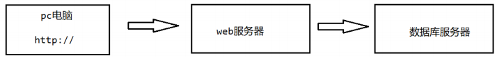
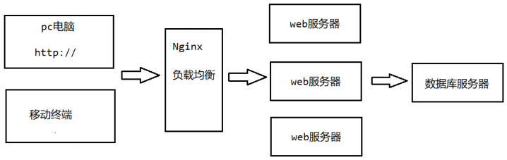
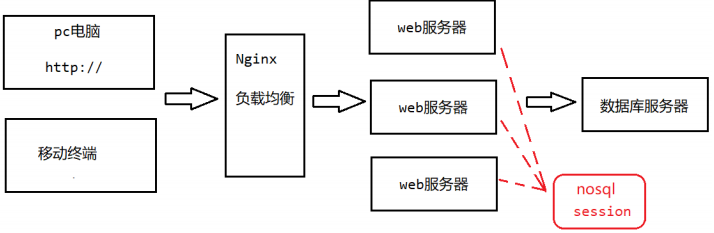

# Redis 数据库

以下的内容都是我的学习笔记。

# 1 NoSql数据库简介

## 1.1 nosql数据库的引入

### 1.1.1 技术的分类

目前我们学过很多技术，比如：

1、解决功能性的问题：JavaSE、Jsp、servlet、Tomcat、HTML、Linux、JDBC、SVN。

2、解决扩展性的问题：Struts、Spring、SpringMVC、Hibernate、Mybatis。

3、解决性能的问题：NoSQL、Java线程、Hadoop、Nginx、MQ、ElasticSearch。

我们开发一个项目，无论这个项目的业务多么复杂，无外乎就是增删改查的操作。而这些功能我们要实现，通过 **解决功能性的问题的技术栈** 就可以轻松实现。但是项目的功能不可能一成不变，项目功能会随着需求的变化不而不断的增加、修改和升级。这个时候我们就需要对项目的功能进行扩展和增强，但是对项目进行扩展和增强我们需要不影响原有代码的前提下进行，此时我们可以使用 **解决扩展性的问题的技术栈（框架）** 进行操作。为什么框架能够解决程序的扩展性问题呢？因为框架定义了一定的约束和规范，我们只需要按照这些约束和规范进行开发就可以解决项目的扩展性问题。

现在我们再思考一个问题，项目开发完成之后，受众用户可能会有很多。随着用户量的不断增加，此时我们需要解决项目的性能问题。今天我们学习的nosql技术就是为了解决项目性能问题的。当然解决项目性能问题的技术栈还有很多，比如多线程技术、Nginx、MQ、ElasticSearch等。

### 1.1.2 web的发展过程

- Web1.0 时代

在Web1.0的时代，由于数据访问量很有限，用一夫当关的高性能的单点服务器可以解决大部分问题。

- Web2.0 时代

随着 Web2.0 的时代的到来，用户访问量大幅度提升，同时产生了大量的用户数据。加上后来的智能移动设备的普及，所有的互联网平台都面临了巨大的性能挑战。

我们需要解决两个问题，第一个是 CPU 及内存的压力，第二个是 IO 压力。

- CPU 及内存的压力

由于一台 web 服务器不能应对海量用户的访问。我们可以考虑对 web 服务器进行冗余部署，可以根据用户的访问量部署多台。再通过 Nginx 对用户的访问进行负载均衡操作，将用户的访问压力分摊在不同的 web 服务器上。

这样操作又会遇到一个问题，就是 session 问题。解决 session 的方案也有很多。

方案1：比如我们可以把 session 里面的数据存放在 cookie 端，以后用户每次发送请求，都可以携带 cookie 里面的数据到服务器。但由于 cookie 存放在浏览器端，如果数据是敏感数据，存放在 cookie 会不安全。

方案2：session 复制。将某台服务器里面的 session 复制一份到其他服务器里面去。这种方案也有缺点，就是把相同的 session 数据存放在不同的 web 服务器中，容易造成数据冗余，服务器空间的浪费。

方案3：设置缓存数据库，将 session 信息存放在缓存数据库里面，缓存数据库里面的数据被所有 web 服务器共享。并且缓存数据库中的数据存放在内存中，读写速度也非常快。

- IO压力

随着项目数据的日积月累，数据库里面的数据也越来越庞大。加上用户访问量的增大，我们直接访问数据库获取数据会对数据库造成非常大的 IO 压力。如何解决?

方案1：考虑对数据库进行读写分离，水平拆分、垂直拆分。但是这种方式会破坏一定的业务规则。

方案2：将频繁查询的数据，放在缓存，以后我们只需要从缓存里获取数据即可，减少对数据库的访问压力。

